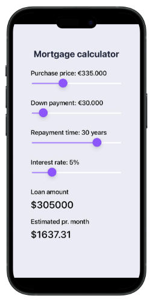

---

# Mortgage calculator



This is a mobile application built using React Native and Expo. Below are the instructions to get the app up and running on your local machine.

## Prerequisites

Before you begin, make sure you have the following installed:

- **Node.js**: You can download and install Node.js from [nodejs.org](https://nodejs.org/).
- **Expo CLI**: Install Expo CLI globally using npm:
  
  ```bash
  npm install -g expo-cli
  ```

- **Git** (optional): To clone the repository, you'll need Git. You can download it from [git-scm.com](https://git-scm.com/).

## Installation

### 1. Clone the Repository

Clone this repository to your local machine using Git:

```bash
git clone https://github.com/Tudor230/mortgage-calculator
```

### 2. Navigate to the Project Directory

Change into the project directory:

```bash
cd mortgage-calculator
```

### 3. Install Dependencies

Install the necessary dependencies for the app:

```bash
npm install
```

Alternatively, if you use yarn:

```bash
yarn install
```

## Running the App

### 1. Start the Expo Development Server

To run the app locally, start the Expo development server by running:

```bash
npx expo start
```

This will open a new tab in your browser showing the Expo Developer Tools.

### 2. Open the App

- **On your physical device**: Scan the QR code displayed in the terminal or on the browser with the **Expo Go** app (available on both iOS and Android).
- **On an Android/iOS emulator**: You can press `a` for Android or `i` for iOS from the terminal to open the app in the respective emulator.

### 3. Develop & Hot Reload

Once the app is running, you can edit the code in your favorite editor. The app will automatically reload with any changes you make to the source code.

## Building the App

If you want to build the app for production, you can use Expo's build service.

- **To build for iOS**: Run `expo build:ios`
- **To build for Android**: Run `expo build:android`

Follow the prompts for each command to generate your app's respective binary.

## Troubleshooting

- If you encounter issues with Expo, try clearing the cache:
  
  ```bash
  expo start -c
  ```

- If the app is not loading on your device/emulator, ensure that your device and computer are on the same Wi-Fi network.


## License

This project is licensed under the MIT License - see the [LICENSE](LICENSE) file for details.

---
